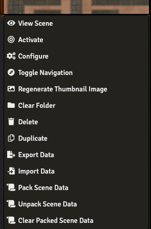

  
  


# Scene Packer

A library to help content creators package up Scenes and Adventures to solve several frustrations when importing Scenes from a module compendium. With Scene Packer the following works:

- Scene Journal Pins link to the correct Journal.
  - This is the feature that started this module. I was frustrated that I could put a Scene into a compendium with journal pins and then when I imported from a compendium, the journal pin was there, but didn't load anything. This module gives you portable compendium journal pins that link to the original journal entry. The journal links will persist when importing from compendiums.
- Actor tokens on a Scene link to the correct Actor.
  - The second frustration that prompted this module. Normally you would import a Scene with Actor tokens on it and they look correct, but don't open anything. So you would have to go through and link them all up again manually. This module gives you portable compendium actor tokens on a scene that link to the original actor data automatically.
- Journals configured for the Scene link correctly.
  - No longer will the Journal dropdown on the Scene configuration screen be empty when importing from a compendium.
- Playlists configured for the Scene link correctly.
  - No longer will the Playlist dropdown on the Scene configuration screen be empty when importing from a compendium.
- Imported Journals link correctly to other Journal entries.
  - By using the automatic link fixer, you won't have broken links due to Journals referencing World entities, rather than compendium entities.
- Actors, Journals and Playlists referenced by a Scene are automatically imported.
- [Quick Encounters](https://foundryvtt.com/packages/quick-encounters) work, creating working journal pins that you can double-click on and actors that are linked correctly.
- You can provide a list of Journals and/or Macros that you want to ensure are imported to the world.
- Entities can be imported with deep folder structures, allowing you as a content creator to have additional folders for journal handouts for instance. (Makes use of the [Compendium Folders](https://foundryvtt.com/packages/compendium-folders) module during packing. End users do not need the Compendium Folders module installed. See the bundled journal entry for more information).

In summary, it makes importing a Scene from a Compendium (via an "adventure module") work as though you build it in your world.

Scene Packer is system agnostic, it doesn't matter whether you're packaging up a D&D5e module, or a Pathfinder one, or an Alien RPG one, Scene Packer doesn't mind.

### Where do I start?

I have put together a site to help build your first module (with or without Scene Packer integration). It takes all of the guess work out of creating your first module, and in a lot of cases means that you don't have to do anything in a text-editor. Simply fill in the form and download your ready-to-go module zip file. https://sneat.github.io/scene-packer-module-generator/

There is also a how to tutorial video which you can follow along with (and is _highly recommended_):

[](https://www.youtube.com/watch?v=cG6qtoZPczI "Scene Packer - How to convert a World to a Module (The Sky Isles)")

### Moulinette

v2.4.0 of Scene Packer added integration with [Moulinette](https://www.moulinette.cloud/) to make it even easier to distribute your packaged adventures and content. Check out the video guide:

[](https://www.youtube.com/watch?v=XZjuE1j_7GQ "Moulinette Integration")

### Asset Report

Additionally, `Scene Packer` contains an `Asset Report` (accessible via the bundled Macro or by right clicking on a Scene in the sidebar) which details which assets will have broken references when imported into someone else's world.

[](https://www.youtube.com/watch?v=GgEQgl4fAjw "Asset Report")

## Installation

In the setup screen, find the module `Library: Scene Packer` under the "Add-on Modules" tab. Alternatively, use the URL https://github.com/League-of-Foundry-Developers/scene-packer/releases/latest/download/module.json to install the module.

## Usage

There are several `Journal entries` bundled with Scene Packer. In them, you can find references on how to use Scene Packer both as a Content Creator and as a GM.

To use the Scene Packer as part of your module you will need to add it as a dependency in your `module.json` file as well as add/update your module javascript (see [Module code requirements](#module-code-requirements) below).

```json
"relationships": {
  "requires": [
    {
      "id": "scene-packer",
      "type": "module"
    }
  ]
}
```

If you would like some help packing your module, feel free to stop by my [
discord server](https://discord.com/invite/HY3xhBEf2A) and I'll happily help.

If you are new to making Foundry VTT modules, you may be interested in the following links to get you started:

- [https://sneat.github.io/scene-packer-module-generator/](https://sneat.github.io/scene-packer-module-generator/) - Fill in the form and download your ready-to-go module.
- [https://github.com/sneat/starter-scene-packer](https://github.com/sneat/starter-scene-packer) - A "quick start" style module integrated with Scene Packer functionality.
- https://foundryvtt.com/article/module-development/
- https://foundryvtt.com/article/content-creation-guide/
- https://foundryvtt.com/article/packaging-guide/
- https://foundryvtt.com/article/media/

### Module code requirements

Once you have added Scene Packer as a dependency you need to add some initialisation code to register your module with Scene Packer.

Include the following in your [module javascript](https://foundryvtt.com/article/module-development/#includes), updating the variable names where appropriate.

```javascript
(() => {
  const adventureName = 'The Name of Your Adventure or Collection';
  const moduleName = 'your-module-name-as-defined-in-your-manifest-file';

  /**
   * welcomeJournal (if set) will automatically be imported and opened after the first activation of a scene imported
   * from the module compendium.
   * Set to the following to disable:
   *   const welcomeJournal = '';
   */
  const welcomeJournal = 'A1. Adventure Introduction';
  /**
   * additionalJournals will automatically be imported.
   * Set to the following to disable:
   *   const additionalJournals = [];
   */
  const additionalJournals = ['A2. Adventure Overview'];
  /**
   * additionalMacros will automatically be imported.
   * Set to the following to disable:
   *   const additionalMacros = [];
   */
  const additionalMacros = [];
  /**
   * creaturePacks is a list of compendium packs to look in for Actors by name (in prioritised order).
   * The first entry here assumes that you have an Actor pack in your module with the "name" of "actors".
   * Set to the following to disable:
   *   const creaturePacks = [];
   */
  const creaturePacks = [];
  /**
   * journalPacks is a list of compendium packs to look in for Journals by name (in prioritised order).
   * The first entry here assumes that you have a Journal pack in your module with the "name" of "journals".
   * Set to the following to disable:
   *   const journalPacks = [];
   */
  const journalPacks = [];
  /**
   * macroPacks is a list of compendium packs to look in for Macros by name (in prioritised order).
   * The first entry here assumes that you have a Macro pack in your module with the "name" of "macros".
   * Set to the following to disable:
   *   const macroPacks = [];
   */
  const macroPacks = [];
  /**
   * playlistPacks is a list of compendium packs to look in for Playlists by name (in prioritised order).
   * The first entry here assumes that you have a Playlist pack in your module with the "name" of "playlists".
   * Set to the following to disable:
   *   const playlistPacks = [];
   */
  const playlistPacks = [];
  /**
   * additionalModulePacks is a list of modules whose compendium packs can be looked in for entities by name (in prioritised order).
   * Enter just the "name" of the module/s or system/s you want to be considered.
   *
   * By default, all packs within your module will be included along with those from the dnd5e system.
   *
   * For example, if you wanted to allow the packs from
   * the [Free Loot Tavern's Magic Item Vault]{@link https://foundryvtt.com/packages/free-loot-tavern-compendium}
   * and [Dynamic Active Effects SRD]{@link https://foundryvtt.com/packages/Dynamic-Effects-SRD}
   * modules to be searchable:
   *   const additionalModulePacks= ['free-loot-tavern-compendium', 'Dynamic-Effects-SRD'];
   *
   * Set to the following to disable:
   *   const additionalModulePacks = [];
   */
  const additionalModulePacks = [moduleName, 'dnd5e'];

  Hooks.once('scenePackerReady', ScenePacker => {
    // Initialise the Scene Packer with your adventure name and module name
    let packer = ScenePacker.Initialise({
      adventureName,
      moduleName,
      creaturePacks,
      journalPacks,
      macroPacks,
      playlistPacks,
      additionalModulePacks,
      welcomeJournal,
      additionalJournals,
      additionalMacros,
      allowImportPrompts: true, // Set to false if you don't want the popup
    });
  });
})()
```

### Packing your Scenes

To pack your scene ready for distribution:

1. Enable the `Scene Packer context menu` in Module Settings.
2. Build your scene as normal, adding Actors and Journal Pins where you'd like.
3. Export your Scenes/Actors/Journals/Roll Tables/Items/Macros/Playlists to your compendiums as normal. 
4. Run the script to Update Journal links to fix up the journal compendium linking (see section below)
5. Right click on your Scene in the Scenes Directory and choose `Pack Scene Data`.
6. Export your Scene to your compendium (replacing your existing entry, merging by name to retain the ID reference).
7. Run the `Asset Report` macro (see above) against your module to verify that all of your assets will work for your users when imported into their world.



### Updating Journal links

When you build an adventure module, it's a painful process updating all of your Journal references to link to the compendium versions. You can simplify this by running the following command in your browser console putting in your appropriate module name (as per your manifest json name):

```js
await ScenePacker.RelinkJournalEntries('module-name', {dryRun: false});
```

Alternatively, you can run the macro `Relink compendium entries` that is included in the Scene Packer compendium, which will prompt you for your module name and whether you want to run in "dry run" mode (not saving changes).

This will automatically go through the compendiums that belong to your module, and change the reference links to the compendium versions. For example, if you had a link to `@Actor[alvhCr52HIrWmoez]{Commoner}` it would change it to `@Compendium[your-module.actors.lOBiqShvkT83eGzY]{Commoner}` using your module and compendium names and ID references.

## Macros

There are several Macros included in the `Library: Scene Packer` compendium entry. Each macro has a comment at the top describing its purpose. It is well worth having a look at what is available there.

There is even a macro there that you can use as the basis for recommending modules for use with your own module.

## Quick Encounters

Support for packing Scenes with embedded [Quick Encounters](https://foundryvtt.com/packages/quick-encounters) data was added in v2.2.0 of Scene Packer. There is a Journal Entry bundled in the Scene Packer compendium which describes how to pack these scenes.

## Hooks

There are several [Hooks](https://foundryvtt.com/api/Hooks.html) exposed by Scene Packer.

`scenePackerReady`
- This hook is called when the Scene Packer class is available to be called.
- Called with a single argument of type `ScenePacker`.
  - See [Module Code Requirements](https://github.com/League-of-Foundry-Developers/scene-packer#module-code-requirements) for how to initialise your module with Scene Packer.

`ScenePacker.importAllComplete`
- Called after all documents in a pack have been imported.
- Called with a single argument of type `ImportedAllEntities`.
```js
Hooks.on("ScenePacker.importAllComplete", (data) => {
 const [moduleName, adventureName, instance] = data;
});
```

`ScenePacker.importMoulinetteComplete`
- Called after documents in a pack have been imported from Moulinette.
- Called with a single argument of type `ImportedMoulinetteEntities`.
```js
Hooks.on("ScenePacker.importMoulinetteComplete", (data) => {
 const [sceneID, actorID, info] = data;
});
```

`ScenePacker.sceneUnpacked`
- Called after a scene has been unpacked.
- Called with a single argument of type `UnpackedScene`.
```js
Hooks.on("ScenePacker.sceneUnpacked", (data) => {
  const [scene, moduleName, adventureName, instance] = data;
});
```

## Example module use

You can view an example module that showcases Scene Packer's features at https://github.com/sneat/example-scene-packer

## Acknowledgements

A portion of the code is based on code created by [honeybadger](https://github.com/trioderegion) and used with permission.

Thanks to [Baileywiki](https://www.patreon.com/baileywiki) for their initial testing and feedback.

The following libraries are utilised within the code:
- [fast-json-stable-stringify](https://github.com/epoberezkin/fast-json-stable-stringify) (MIT License)
- [jsHashes](https://github.com/h2non/jshashes) (BSD-3-Clause License)

The green "hand truck" icon was created by [Delapouite](https://game-icons.net/1x1/delapouite/hand-truck.html).

## Support

Please submit any issues via the [Bug Reporter](https://foundryvtt.com/packages/bug-reporter) module or via [GitHub Issues](https://github.com/League-of-Foundry-Developers/scene-packer/issues).

You can contact me on Discord `blair#9056` in the [
 Scene Packer server](https://discord.com/invite/HY3xhBEf2A) or the `Foundry VTT server` if you have questions, comments, queries, suggestions etc.

If you are making money and utilising this module, please consider sending a few dollars my way and/or providing me with the cool adventures and modules you're building :)

[](https://www.patreon.com/blairm)

[](https://ko-fi.com/A0A0488MI)
